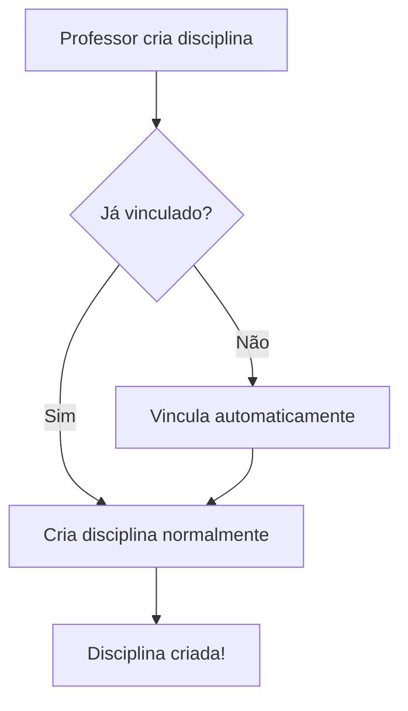

# 🚀 Início Rápido: Vínculos Professor-Instituição

## 📌 O Que Mudou?

Agora um professor pode lecionar em **várias instituições** ao mesmo tempo!

## ⚡ Passo a Passo

### 1️⃣ Execute a Migração no Banco

Abra o **SQL Editor do Supabase** e execute:

```bash
database/migracao-professor-multiplas-instituicoes.sql
```

**O que isso faz:**
- ✅ Cria tabela de relacionamento professor ↔️ instituições
- ✅ Migra dados existentes
- ✅ Configura políticas de segurança
- ✅ Cria funções auxiliares

### 2️⃣ Crie uma Disciplina

1. Acesse: `http://localhost:3001/professor/disciplinas`
2. Clique em **"Adicionar Disciplina"**
3. **Selecione a instituição**
4. Preencha nome, código, etc.
5. Salve

**Resultado:** Você foi automaticamente vinculado à instituição! 🎉

### 3️⃣ Gerencie Seus Vínculos

1. Na página de disciplinas, clique em **"Meus Vínculos"**
2. Veja todas as instituições onde você leciona
3. Adicione novos vínculos manualmente (se quiser)
4. Remova vínculos antigos

## 🎯 Casos de Uso

### Caso 1: Professor em 2 Universidades
```
Professor João:
├── Universidade A (desde 2020)
│   ├── Disciplina: Programação I
│   └── Disciplina: Algoritmos
└── Universidade B (desde 2023)
    └── Disciplina: Estruturas de Dados
```

### Caso 2: Professor Visitante
```
Professora Maria:
├── Universidade Federal (Professor Titular)
├── Faculdade Particular (Professor Visitante - 6 meses)
└── Instituição Online (Tutor)
```

## 🔄 Fluxo de Trabalho



## 📱 Interfaces

### Página: Meus Vínculos
- **URL:** `/professor/meus-vinculos`
- **Funcionalidades:**
  - Ver todas instituições vinculadas
  - Adicionar vínculo com cargo
  - Remover vínculo
  - Ver data de início

### Página: Disciplinas (Atualizada)
- **URL:** `/professor/disciplinas`
- **Novidade:**
  - Botão "Meus Vínculos" no topo
  - Vínculo automático ao criar disciplina

## ❓ FAQ

### Como funciona o vínculo automático?

Ao criar uma disciplina em uma instituição onde você ainda não leciona, o sistema:
1. Detecta que você não está vinculado
2. Cria o vínculo automaticamente
3. Mostra mensagem de confirmação

### Posso estar em quantas instituições?

**Sem limite!** Você pode lecionar em quantas instituições quiser.

### O que acontece se eu remover um vínculo?

As disciplinas continuam existindo! Apenas o vínculo é marcado como inativo.

### Posso gerenciar manualmente os vínculos?

Sim! Use a página `/professor/meus-vinculos` para:
- Adicionar vínculos antes de criar disciplinas
- Remover vínculos de instituições antigas
- Ver todos seus vínculos

### Posso definir um cargo diferente em cada instituição?

Sim! Ao adicionar vínculo, você pode especificar:
- Professor Titular
- Professor Adjunto
- Professor Visitante
- Tutor
- Coordenador
- etc.

## 🔍 Consultas Úteis

### Ver meus vínculos no banco:
```sql
SELECT 
  i.nome as instituicao,
  pi.cargo,
  pi.data_inicio,
  pi.ativo
FROM syllab_professor_instituicoes pi
JOIN syllab_instituicoes i ON pi.instituicao_id = i.id
WHERE pi.professor_id IN (
  SELECT id FROM syllab_professores 
  WHERE user_id = auth.uid()
)
ORDER BY pi.data_inicio DESC;
```

### Ver minhas disciplinas por instituição:
```sql
SELECT 
  i.nome as instituicao,
  COUNT(d.id) as total_disciplinas
FROM syllab_disciplinas d
JOIN syllab_instituicoes i ON d.instituicao_id = i.id
WHERE d.professor_id IN (
  SELECT id FROM syllab_professores 
  WHERE user_id = auth.uid()
)
GROUP BY i.nome;
```

## 🐛 Problemas Comuns

### "Professor não aparece na lista"
**Causa:** Migração não executada ou professor não vinculado  
**Solução:** 
1. Execute a migração
2. Crie uma disciplina (vínculo será criado automaticamente)

### "Você já está vinculado a esta instituição"
**Causa:** Vínculo já existe  
**Solução:** Normal! Apenas crie a disciplina, não precisa vincular novamente

### "Erro ao criar vínculo"
**Causa:** Problemas com políticas RLS  
**Solução:** Execute o script de migração completo

## 📚 Documentação Completa

Para mais detalhes técnicos:
- [SISTEMA-MULTIPLOS-VINCULOS.md](SISTEMA-MULTIPLOS-VINCULOS.md)

---

**Pronto para usar!** 🚀  
Qualquer dúvida, consulte a documentação completa.
