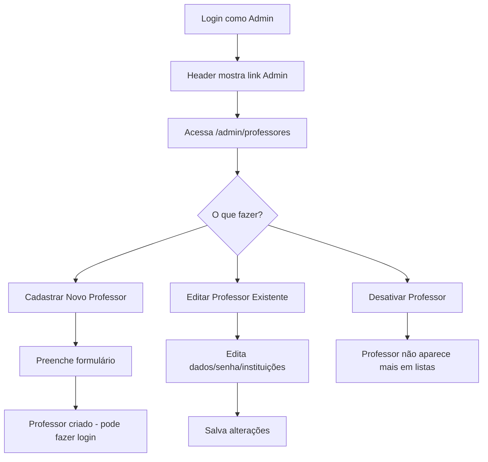
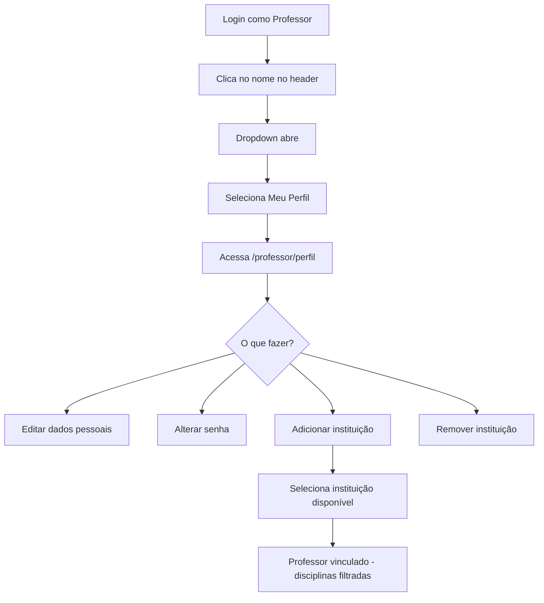

# 👨‍💼 Módulo de Administração - Syllab

## 📋 Visão Geral

O módulo de administração permite que administradores gerenciem professores, suas instituições, tokens de IA e outras configurações do sistema. Professores também podem gerenciar seu próprio perfil.

---

## 🎯 Funcionalidades

### Para Administradores

- ✅ **Gerenciar Professores**
  - Listar todos os professores com filtros e busca
  - Cadastrar novos professores
  - Editar dados completos de professores
  - Ativar/desativar professores
  - Alterar senha de professores
  - Gerenciar vínculos com instituições
  - Configurar tokens de IA

- ✅ **Dashboard de Estatísticas**
  - Total de professores cadastrados
  - Professores ativos
  - Professores com token de IA configurado

### Para Professores

- ✅ **Meu Perfil**
  - Editar dados pessoais (nome, email, telefone, CPF)
  - Upload de foto de perfil (via URL)
  - Configurar token de IA pessoal
  - Alterar própria senha
  - Adicionar-se a instituições
  - Remover vínculos com instituições
  - Ver apenas instituições que faz parte

---

## 🗄️ Estrutura do Banco de Dados

### Tabela `syllab_administradores`

```sql
CREATE TABLE syllab_administradores (
  id UUID PRIMARY KEY DEFAULT uuid_generate_v4(),
  user_id UUID NOT NULL UNIQUE REFERENCES auth.users(id),
  nome VARCHAR(255) NOT NULL,
  email VARCHAR(255) NOT NULL UNIQUE,
  foto_url TEXT,
  super_admin BOOLEAN DEFAULT false,
  ativo BOOLEAN DEFAULT true,
  created_at TIMESTAMP WITH TIME ZONE DEFAULT NOW(),
  updated_at TIMESTAMP WITH TIME ZONE DEFAULT NOW()
);
```

**Campos Adicionais em `syllab_professores`:**

- `foto_url` (TEXT): URL da foto do professor
- `token_ia` (TEXT): Token de API para serviços de IA

### Views Disponíveis

#### `v_admin_professores`
Visão completa dos professores com estatísticas:
- Dados pessoais completos
- Total de instituições vinculadas
- Nomes das instituições (concatenados)
- Total de disciplinas

#### `v_professor_instituicoes_disponiveis`
Lista todas as instituições e indica quais o professor está vinculado

---

## 📂 Estrutura de Arquivos

```
Syllab/
├── database/
│   └── add-admin-module.sql           # Migração do módulo admin
├── lib/
│   └── auth.ts                         # Funções de autenticação expandidas
├── components/
│   └── header.tsx                      # Header com dropdown de usuário
└── app/
    ├── admin/
    │   └── professores/
    │       ├── page.tsx                # Lista de professores
    │       ├── novo/
    │       │   └── page.tsx            # Cadastrar professor
    │       └── [id]/
    │           └── page.tsx            # Editar professor
    └── professor/
        └── perfil/
            └── page.tsx                # Perfil do professor
```

---

## 🚀 Instalação

### 1. Execute a Migração do Banco de Dados

```bash
# Acesse o SQL Editor do Supabase e execute:
database/add-admin-module.sql
```

### 2. Crie o Primeiro Super Admin

**Importante:** Edite o script SQL e descomente a seção final:

```sql
INSERT INTO syllab_administradores (user_id, nome, email, super_admin, ativo)
SELECT 
  id as user_id,
  COALESCE(raw_user_meta_data->>'name', email) as nome,
  email,
  true as super_admin,
  true as ativo
FROM auth.users
WHERE email = 'seu-email@exemplo.com' -- ⚠️ SUBSTITUA AQUI
ON CONFLICT (user_id) DO NOTHING;
```

**Substitua `'seu-email@exemplo.com'`** pelo email que você usa para fazer login no sistema.

### 3. Teste o Acesso

1. Faça login com o email configurado como super admin
2. Você verá o link "Admin" no header
3. Acesse `/admin/professores`

---

## 🎨 Interface do Usuário

### Header Atualizado

O header agora possui um dropdown ao clicar no nome do usuário:

**Para Professores:**
- 👤 Meu Perfil
- 🚪 Sair

**Para Administradores:**
- 👤 Meu Perfil
- 👥 Gerenciar Professores (link azul)
- 🚪 Sair

### Página de Listagem de Professores (`/admin/professores`)

**Recursos:**
- 📊 Dashboard com 3 cards de estatísticas
- 🔍 Busca por nome ou email
- 📋 Tabela com:
  - Foto do professor
  - Nome e email
  - Total de instituições e disciplinas
  - Status do token de IA
  - Status ativo/inativo
  - Botões de ação (Editar e Ativar/Desativar)

### Página de Cadastro (`/admin/professores/novo`)

**Campos do Formulário:**
- Nome Completo *
- Email *
- Senha * (mínimo 6 caracteres)
- Telefone
- CPF
- URL da Foto (com preview automático)
- Token de IA (textarea)

**Processo:**
1. Cria usuário no Supabase Auth
2. Cria registro na tabela `syllab_professores`
3. Professor pode fazer login imediatamente

### Página de Edição (`/admin/professores/[id]`)

**Layout em 2 Colunas:**

**Coluna Esquerda:**
- Formulário completo de dados do professor
- Foto de perfil exibida no topo

**Coluna Direita:**
- Card "Alterar Senha"
  - Campo para nova senha
  - Admin pode alterar senha de qualquer professor
- Card "Instituições"
  - Lista de vínculos atuais (com cargo)
  - Botão para remover vínculo
  - Formulário para adicionar nova instituição

### Página Meu Perfil (`/professor/perfil`)

**Similar à página de edição do admin, mas:**
- Professor só vê seus próprios dados
- Não pode desativar a si mesmo
- Alteração de senha requer confirmação
- Ao adicionar instituição, o professor "se insere" na instituição
- Lista filtrada mostra apenas instituições que o professor faz parte

---

## 🔐 Controle de Acesso

### Funções de Autenticação (`lib/auth.ts`)

```typescript
// Verifica se usuário é admin
await isAdmin() // => boolean

// Verifica se usuário é super admin
await isSuperAdmin() // => boolean

// Obtém dados do admin logado
await getCurrentAdmin() // => Admin | null

// Obtém dados do professor logado
await getCurrentProfessor() // => Professor | null

// Obtém dados completos (professor + admin)
await getCurrentUserData() // => { user, professor, admin, isAdmin, isProfessor }

// Redireciona se não for admin
await requireAdmin() // Usado em páginas /admin
```

### Políticas RLS

**Desenvolvimento:**
- Todas as políticas estão abertas para desenvolvimento
- Prefixadas com "- DESENVOLVIMENTO"

**Produção (implementar depois):**
- SELECT: Apenas admins ativos
- INSERT/UPDATE/DELETE: Apenas super admins

---

## 🎓 Fluxo de Uso

### Fluxo do Administrador



### Fluxo do Professor



---

## 💡 Tokens de IA

### Propósito

Os tokens de IA servem para integração futura com serviços de Inteligência Artificial como:
- OpenAI (GPT-4, ChatGPT)
- Anthropic (Claude)
- Google (Gemini)
- Outros serviços de IA

### Como Usar

**Administrador:**
1. Acessa edição do professor
2. Cola o token no campo "Token de IA"
3. Salva

**Professor:**
1. Acessa "Meu Perfil"
2. Cola seu token pessoal no campo "Token de IA"
3. Salva

**Nota:** O token não é exibido em texto plano na listagem (apenas "Configurado" ou "Não configurado")

### Exemplo de Token

```
sk-proj-aBcDeFgHiJkLmNoPqRsTuVwXyZ1234567890aBcDeFgH...
```

---

## 🔧 Personalização

### Adicionar Novos Campos ao Professor

```sql
-- No Supabase SQL Editor
ALTER TABLE syllab_professores 
ADD COLUMN novo_campo VARCHAR(100);
```

Depois, edite os arquivos:
- `/app/admin/professores/[id]/page.tsx` (admin)
- `/app/professor/perfil/page.tsx` (professor)

### Adicionar Permissões Granulares

Crie novos campos boolean em `syllab_administradores`:

```sql
ALTER TABLE syllab_administradores 
ADD COLUMN pode_criar_professores BOOLEAN DEFAULT false,
ADD COLUMN pode_editar_professores BOOLEAN DEFAULT false,
ADD COLUMN pode_deletar_professores BOOLEAN DEFAULT false;
```

Depois atualize as verificações nas páginas.

### Criar Outros Tipos de Admin

```sql
-- Exemplo: Admin de Instituição (gerencia apenas sua instituição)
CREATE TABLE syllab_admin_instituicoes (
  id UUID PRIMARY KEY DEFAULT uuid_generate_v4(),
  admin_id UUID REFERENCES syllab_administradores(id),
  instituicao_id UUID REFERENCES syllab_instituicoes(id),
  UNIQUE(admin_id, instituicao_id)
);
```

---

## 📊 Views e Consultas Úteis

### Listar todos os admins

```sql
SELECT 
  nome, 
  email, 
  super_admin, 
  ativo 
FROM syllab_administradores 
ORDER BY created_at DESC;
```

### Professores sem token de IA

```sql
SELECT 
  nome, 
  email 
FROM syllab_professores 
WHERE token_ia IS NULL 
  AND ativo = true;
```

### Estatísticas de vinculações

```sql
SELECT 
  p.nome,
  COUNT(pi.id) as total_vinculos
FROM syllab_professores p
LEFT JOIN syllab_professor_instituicoes pi ON p.id = pi.professor_id AND pi.ativo = true
GROUP BY p.id, p.nome
ORDER BY total_vinculos DESC;
```

---

## ❓ FAQ

### Como tornar um professor em administrador?

```sql
INSERT INTO syllab_administradores (user_id, nome, email, super_admin, ativo)
SELECT user_id, nome, email, false, true
FROM syllab_professores
WHERE email = 'professor@exemplo.com';
```

### Um usuário pode ser professor E administrador?

✅ **Sim!** O sistema suporta usuários com ambos os papéis. O header mostrará ambas as opções.

### Como remover status de admin de alguém?

```sql
UPDATE syllab_administradores 
SET ativo = false 
WHERE email = 'ex-admin@exemplo.com';
```

### Como alterar senha de um usuário via SQL?

Não é possível via SQL direto. Use a interface admin em `/admin/professores/[id]` ou o Supabase Dashboard.

### Professor pode se tornar admin sozinho?

❌ **Não.** Apenas super admins podem criar novos administradores via SQL ou interface futura.

---

## 🔍 Troubleshooting

### Link "Admin" não aparece no header

**Verificar:**
1. Usuário está na tabela `syllab_administradores`?
   ```sql
   SELECT * FROM syllab_administradores WHERE email = 'seu-email@exemplo.com';
   ```
2. Campo `ativo` está `true`?
3. Fez logout e login novamente?

### Erro ao criar novo professor

**Possíveis causas:**
- Email já cadastrado no Supabase Auth
- Senha menor que 6 caracteres
- Políticas RLS muito restritivas

**Solução:**
```sql
-- Verificar se email já existe
SELECT email FROM auth.users WHERE email = 'email@exemplo.com';
```

### Instituições não aparecem ao adicionar vínculo

**Verificar:**
1. Existem instituições cadastradas?
   ```sql
   SELECT * FROM syllab_instituicoes WHERE ativo = true;
   ```
2. Instituições já não estão vinculadas?

---

## 📝 Checklist de Implementação

- [x] Criar migração do banco de dados
- [x] Adicionar funções de auth para admin
- [x] Criar página de listagem de professores
- [x] Criar página de cadastro de professor
- [x] Criar página de edição de professor
- [x] Criar página de perfil do professor
- [x] Atualizar header com dropdown
- [x] Documentação completa
- [ ] Executar migração no Supabase
- [ ] Criar primeiro super admin
- [ ] Testar todas as funcionalidades
- [ ] Ajustar políticas RLS para produção

---

## 🎉 Próximos Passos

1. **Upload de Imagens**
   - Integrar Supabase Storage para upload direto de fotos
   - Substituir campo `foto_url` por sistema de upload

2. **Auditoria**
   - Criar tabela de logs de ações dos admins
   - Registrar quem alterou o quê e quando

3. **Permissões Granulares**
   - Sistema de roles e permissions mais detalhado
   - Admin pode gerenciar apenas sua instituição

4. **Dashboard Avançado**
   - Gráficos de uso do sistema
   - Relatórios de professores e disciplinas
   - Exportação para CSV/PDF

5. **Notificações**
   - Email ao criar novo professor
   - Email ao alterar senha
   - Notificações no sistema

---

## 📚 Recursos Adicionais

- [Documentação do Supabase Auth](https://supabase.com/docs/guides/auth)
- [Documentação do Supabase Storage](https://supabase.com/docs/guides/storage)
- [Next.js App Router](https://nextjs.org/docs/app)
- [Tailwind CSS](https://tailwindcss.com/docs)

---

**Desenvolvido com ❤️ para o Syllab**

*Última atualização: {{ data_atual }}*
